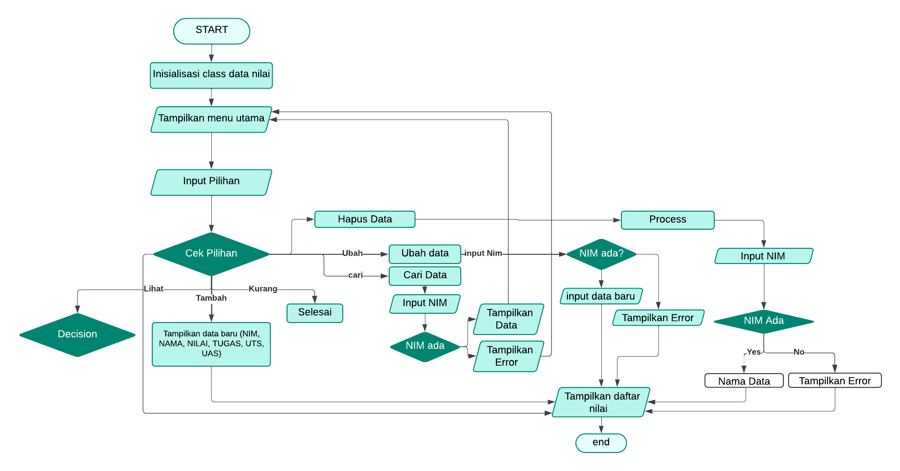

# Program Input Nilai Mahasiswa

Program sederhana untuk mengelola data nilai mahasiswa menggunakan Python dengan struktur data Dictionary.


# Flowchart

`


Untuk Fitur lainnya bisa dicoba sendiri


## Deskripsi Program

Program ini merupakan implementasi sistem manajemen data nilai mahasiswa dengan fitur CRUD (Create, Read, Update, Delete) menggunakan bahasa pemrograman Python. Program menyimpan data dalam bentuk dictionary dengan NIM sebagai key dan data mahasiswa sebagai value.

## Fitur Program

1. **Lihat Data (L)**
   - Menampilkan daftar nilai seluruh mahasiswa
   - Format tampilan menggunakan tabel dengan header yang jelas
   - Menampilkan "TIDAK ADA DATA" jika belum ada data yang tersimpan

2. **Tambah Data (T)**
   - Input data mahasiswa baru (NIM, Nama, Nilai Tugas, UTS, UAS)
   - Perhitungan nilai akhir otomatis dengan bobot:
     - Tugas: 30%
     - UTS: 35%
     - UAS: 35%
   - Data langsung ditampilkan setelah penambahan

3. **Ubah Data (U)**
   - Mencari data berdasarkan NIM
   - Memungkinkan perubahan semua komponen data
   - Menampilkan pesan error jika NIM tidak ditemukan
   - Data langsung diperbarui setelah perubahan

4. **Hapus Data (H)**
   - Menghapus data berdasarkan NIM
   - Konfirmasi penghapusan data
   - Menampilkan pesan error jika NIM tidak ditemukan

5. **Cari Data (C)**
   - Mencari dan menampilkan data berdasarkan NIM
   - Menampilkan detail lengkap data mahasiswa
   - Menampilkan pesan error jika NIM tidak ditemukan

## Struktur Program

### Class DataNilai
```python
class DataNilai:
    def __init__(self):
        self.data = {}  # Dictionary untuk menyimpan data
```

#### Metode-metode dalam Class:

1. `tampilkan_menu()`
   - Menampilkan menu utama program
   - Format: [(L)ihat, (T)ambah, (U)bah, (H)apus, (C)ari (K)eluar]

2. `tampilkan_daftar()`
   - Menampilkan data dalam format tabel
   - Menggunakan string formatting untuk alignment
   - Menghitung nilai akhir otomatis

3. `tambah_data()`
   - Input dan validasi data baru
   - Menyimpan data ke dictionary
   - Menampilkan data setelah penambahan

4. `ubah_data()`
   - Mencari data berdasarkan NIM
   - Input data baru
   - Update dictionary
   - Menampilkan data setelah perubahan

5. `hapus_data()`
   - Mencari dan menghapus data berdasarkan NIM
   - Konfirmasi penghapusan
   - Menampilkan data setelah penghapusan

6. `cari_data()`
   - Mencari dan menampilkan detail data
   - Format tampilan yang rapi

## Cara Penggunaan

1. Jalankan program dengan perintah:
   ```bash
   python program_nilai.py
   ```

2. Pilih menu dengan memasukkan huruf sesuai pilihan:
   - L: Lihat data
   - T: Tambah data
   - U: Ubah data
   - H: Hapus data
   - C: Cari data
   - K: Keluar program

3. Ikuti instruksi yang muncul untuk setiap operasi

## Algoritma Program

1. **Inisialisasi Program**
   - Buat instance class DataNilai
   - Tampilkan menu utama

2. **Loop Utama Program**
   - Terima input pilihan menu
   - Jalankan metode sesuai pilihan
   - Ulangi sampai pilihan 'K' (Keluar)

3. **Pengelolaan Data**
   - Data disimpan dalam dictionary
   - NIM sebagai key
   - Data mahasiswa sebagai value dalam bentuk dictionary

4. **Perhitungan Nilai**
   - Nilai Akhir = (Tugas * 30%) + (UTS * 35%) + (UAS * 35%)
   - Hasil ditampilkan dengan 2 desimal

## Persyaratan Sistem

- Python 3.x
- Tidak memerlukan library eksternal

## Kontribusi

Silakan berkontribusi dengan cara:
1. Fork repository
2. Buat branch baru
3. Commit perubahan
4. Push ke branch
5. Buat Pull Request

## Lisensi

Program ini dibuat untuk tujuan pembelajaran dan bebas digunakan sesuai kebutuhan.


